# 🚀 Panduan Instalasi Laragon, Composer, dan Laravel (Windows)
=======

Dokumen ini menjelaskan langkah-langkah untuk menginstal XAMPP, Composer, dan Laravel 11 pada sistem operasi **Windows**, lengkap dengan gambar pendukung. Seluruh gambar disimpan di dalam folder [`images/`](./images/) dalam struktur repository GitHub.

---

# Instalisasi Laragon

1.Buka website resmi laragon https://laragon.org 
 
 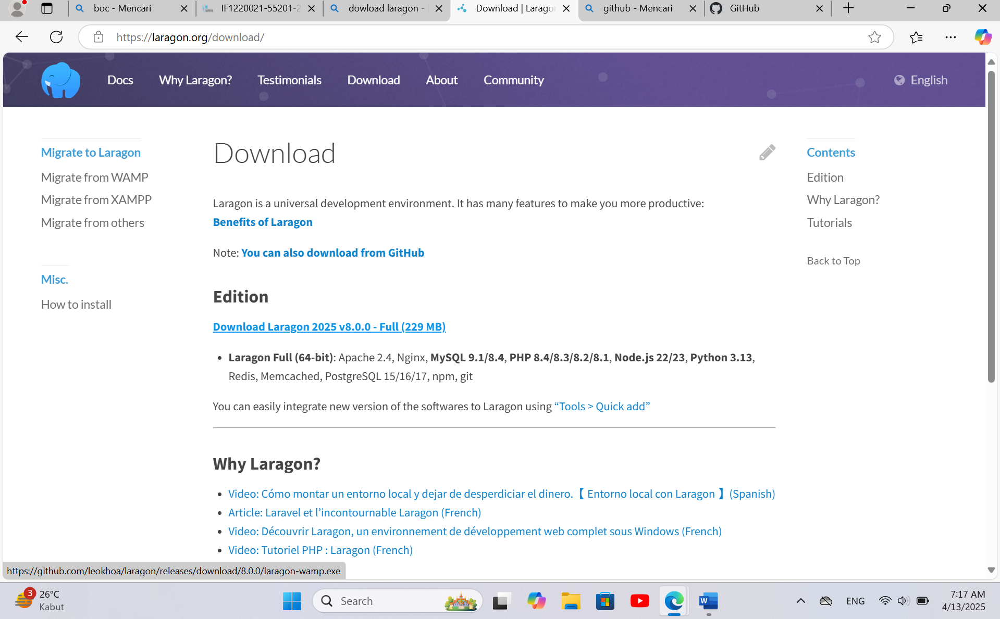
Klik Dowloadad

# 2.Install PhpMyAdmin terlebih dahulu
 
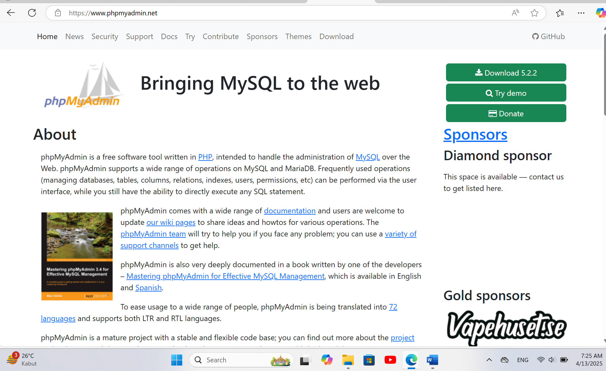

# 3.Jika Sudah terinstall aplikasi laragon,buka aplikasi laragon
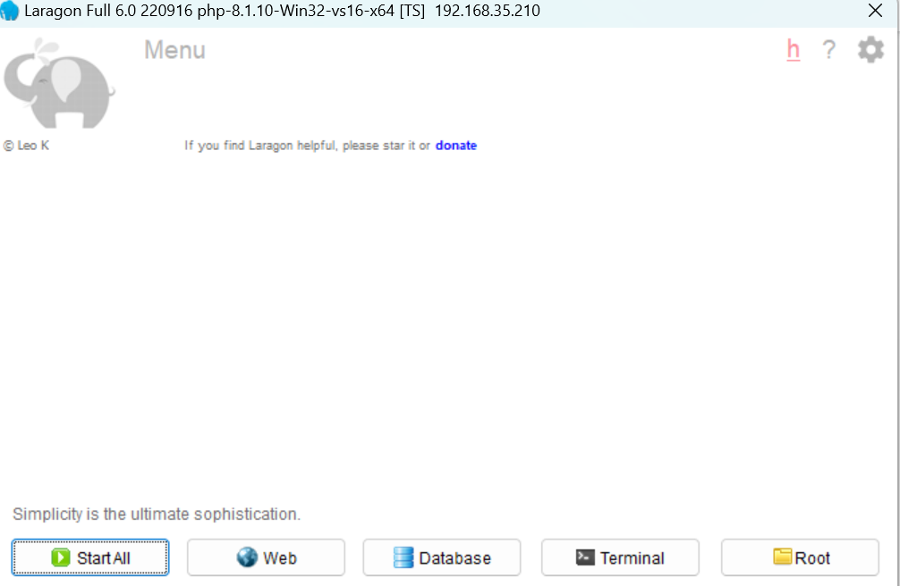
 
Klik Start All untuk menjalankan apache dan MySql

# 4.Jika berhasil instalisasi laragon muncul seperti gambar dibawah ini
 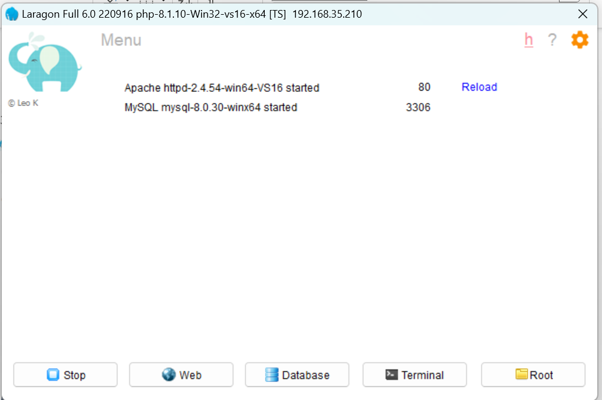
Laragon berhasil di install dan siap di gunakan

# cara menambahkan path file PHP ke dalam Environment Variables di Windows
1.	Cari Folder PHP Dan Copy Path PHP
 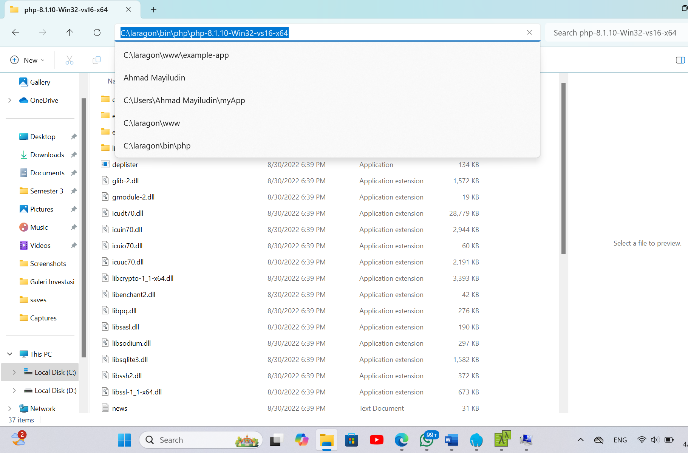
2.	Buka Environment Variables
•  Tekan tombol Windows + S, ketik: environment variables
Klik Edit the system environment variables
•  Di jendela System Properties, klik: Environment Variables

3.	Edit Path
1)	Di bawah bagian System Variables (atau User jika kamu mau lokal):
•	Cari dan klik Path
•	Klik Edit...
2)	Klik New → Paste path PHP tadi
3)	Klik OK semua sampai keluar.

4.	Cek Lewat Terminal Apakah Sudah Terpasang File PHP Di Path
 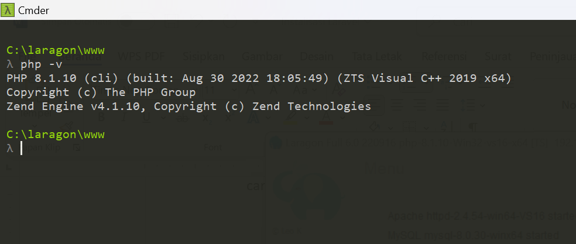
Jika Muncul PHP 8.1.10 (cli) ...Berarti Sudah Terpasang Dan Berhasil

# Cara Instalisasi Laravel Di Terminal

1.	Buka Terminal di aplikasi Laragon
 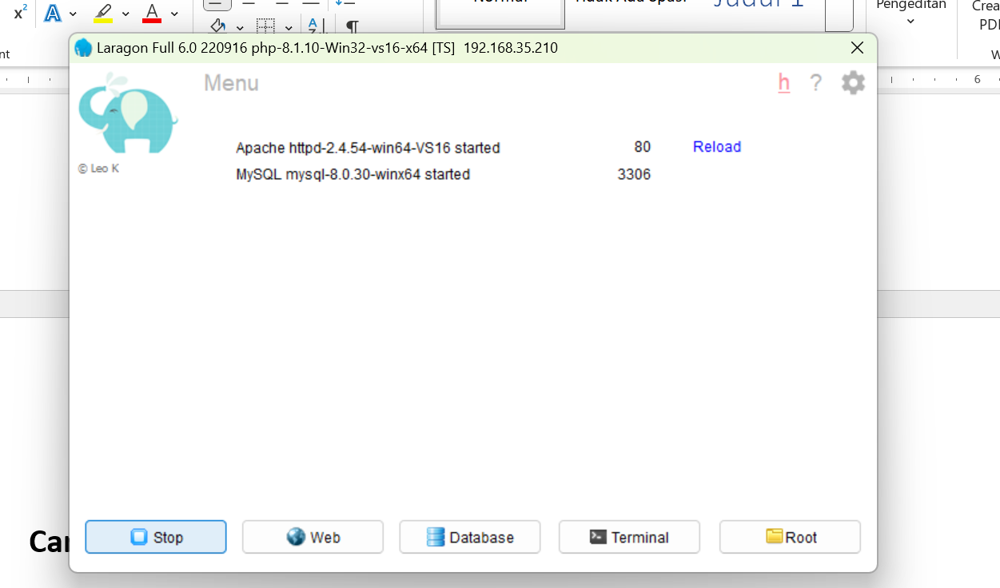
2.	Install Laravel (dengan Composer)
Ketik composer create-project laravel/laravel Project-Ahmad di Terminal lalu hasilnya seperti di bawah ini
  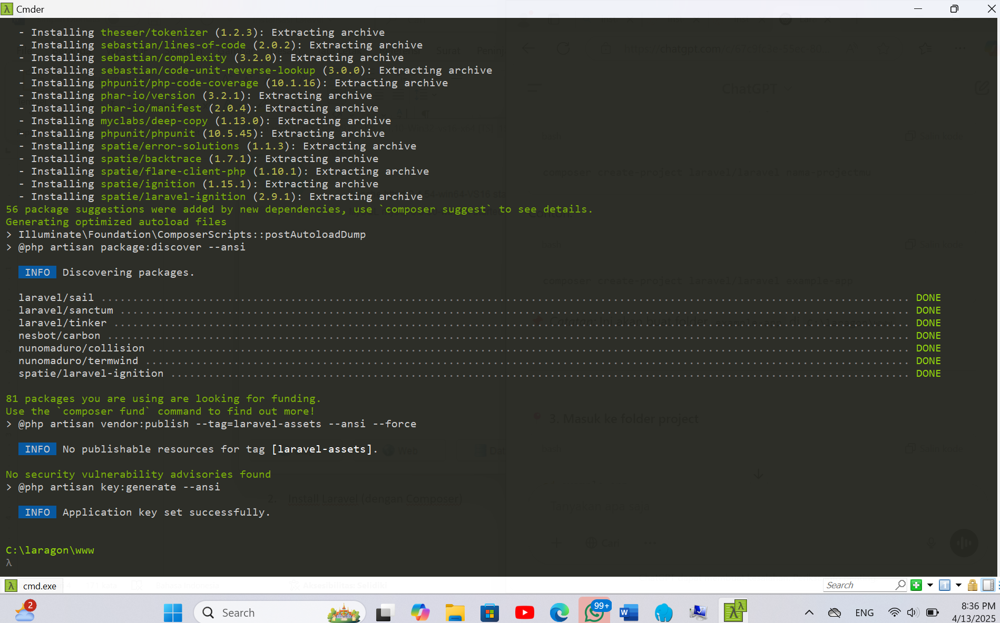
Ini akan buat folder Proeject-Ahmad di C:\laragon\www

3.	Cek Ke Folder Apakah Sudah Muncul File nya
  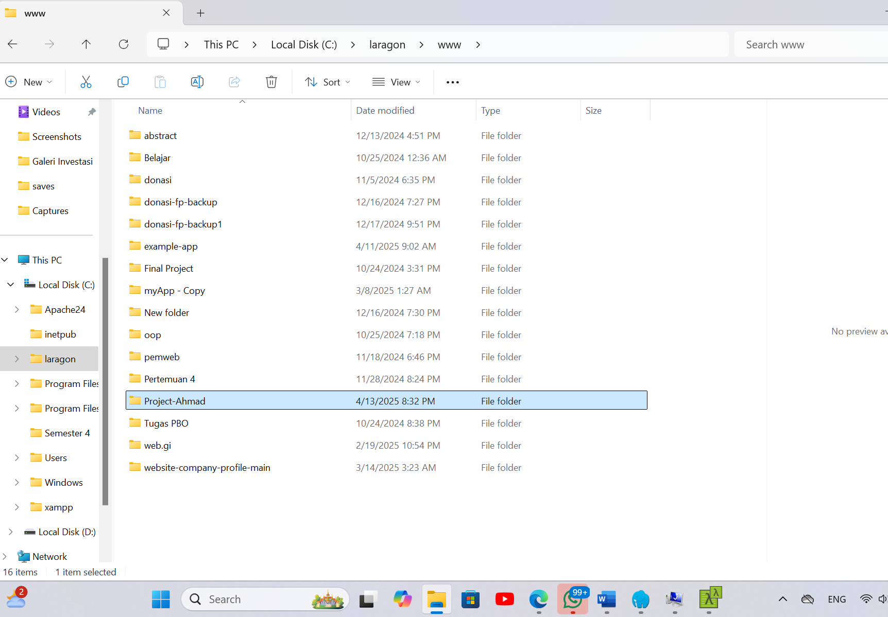

4.	Cek Laravel apakah berhasil terinstall

  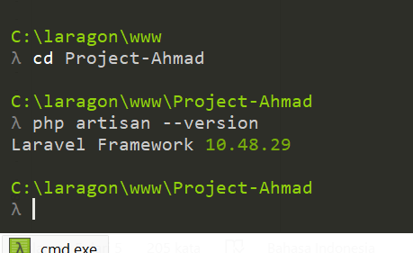

5.	Jalankan Laravel

  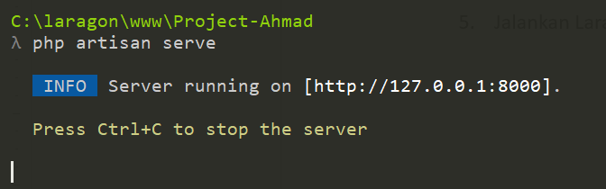

6.	Ketik Project-Ahmad.test di google apakah sudah aktif
  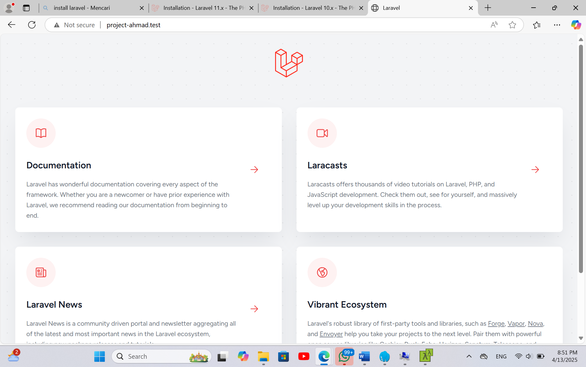
Laravel sudah aktif dan siap dipakai.
